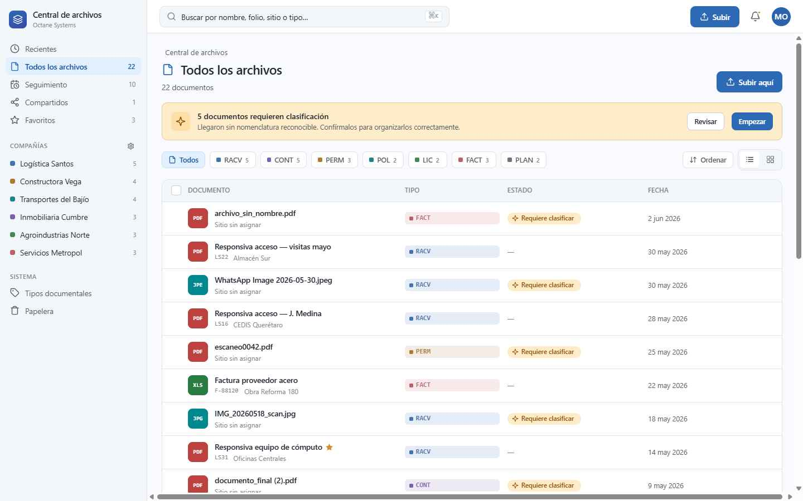
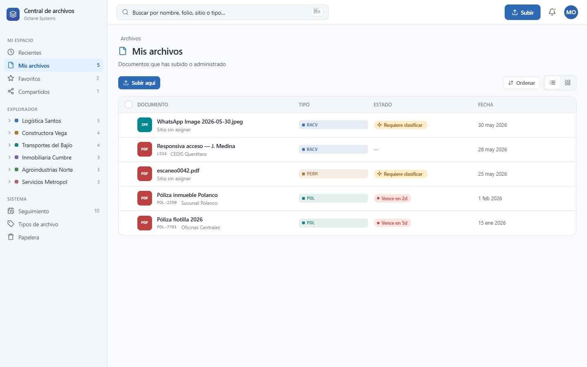

# Central de archivos — Octane Systems

Sistema de gestión documental web para Octane Systems. Permite organizar, clasificar, y dar seguimiento a documentos por empresa, centro de costos y tipo de archivo.

## Funcionalidades

- Explorador de archivos con vista de lista y cuadrícula
- Clasificación por empresa, centro de costos y tipo de documento
- Seguimiento de vencimientos y estatus de documentos
- Vista de documentos compartidos
- Gestión de permisos por perfil
- Catálogo de requisitos obligatorios
- Búsqueda global y por columna
- Subida y reclasificación de documentos (modal)
- Selección múltiple con acciones en lote

## Tecnologías

- React 18 (vía CDN, sin build step)
- Babel Standalone (compilación JSX en el navegador)
- CSS puro con variables (`styles.css`)
- Sin dependencias de Node.js

## Estructura del proyecto

```
├── Central de archivos v2.html   # Entrada principal
├── styles.css                    # Estilos globales
├── icons.jsx                     # Componentes de íconos
├── data.jsx                      # Datos y tipos (mock)
├── ui.jsx                        # Componentes base (Sidebar, Topbar, etc.)
├── search.jsx                    # Búsqueda y filtros
├── explorer.jsx                  # Vista explorador de archivos
├── detail.jsx                    # Panel lateral de detalle
├── upload.jsx                    # Modales de subida y reclasificación
├── tracking.jsx                  # Vista de seguimiento
├── permissions.jsx               # Vista de permisos
├── requisitos.jsx                # Catálogo de requisitos
├── app.jsx                       # Componente raíz y navegación
└── screenshots/                  # Capturas de pantalla
```

## Cómo usar

No requiere instalación. Simplemente abre `Central de archivos v2.html` en un navegador.

> **Nota:** Por usar módulos JSX con `<script type="text/babel" src="...">`, algunos navegadores bloquean la carga de archivos locales por CORS. Si ves una pantalla en blanco al abrir el HTML directamente, usa un servidor local:
>
> ```bash
> # Con Python
> python -m http.server 8080
>
> # Con Node.js (npx)
> npx serve .
> ```
>
> Luego abre `http://localhost:8080/Central%20de%20archivos%20v2.html`

## Capturas de pantalla




